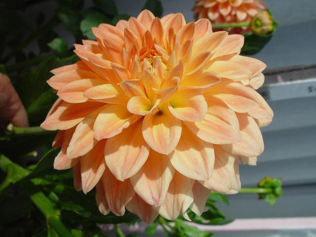
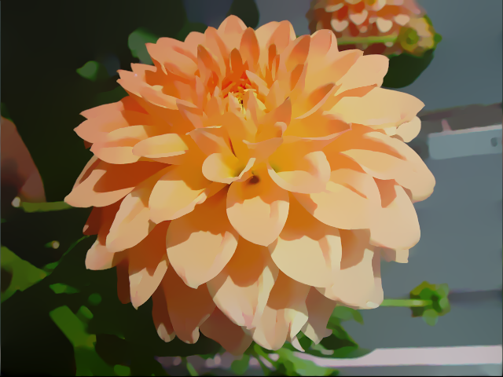
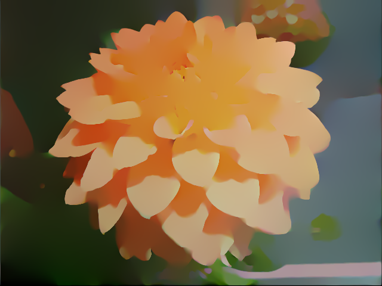

L0-gradient-smoothing
=====================
---------------------------------------------
This is a C++ implementation of "Image Smoothing via L0 Gradient Minimization", Li Xu, Cewu Lu, Yi Xu, Jiaya Jia, SIGGRAPH ASIA 2011.

###Dependencies:
The code depends on following libraries.

* OpenCV 2.4.9
* Eigen 3.2
* Boost 1.55.0

### Build:
You can build the code using CMake.

	mkdir build	
	cd build
	cmake ..
	make 
	

### Usage:
	usage: L0-gradient-minimization [-h] [-i input_img] [-o out_dir] [-c cofig_name]
	
	arguments:
	 	-h, --help       show help message
	 	-i, --input	     input image filename 
	 	-o, --output     output path
	 	-c, --config     config filename

Parameters in the algorithm can be controlled through a config file. Config file must include following entries. See `config_sample.txt`.
	
	lambda:     smoothing parameter
	beta_max:   parameter of the termination of the algorithm
	kappa:      parameter relating to the speed of the algorithm
	exact:      solver type for linear system. if true LU factorization is used , else Conjugate Gradient method is used
	
### Example:
input

output(λ=0.005)

output(λ=0.03)

